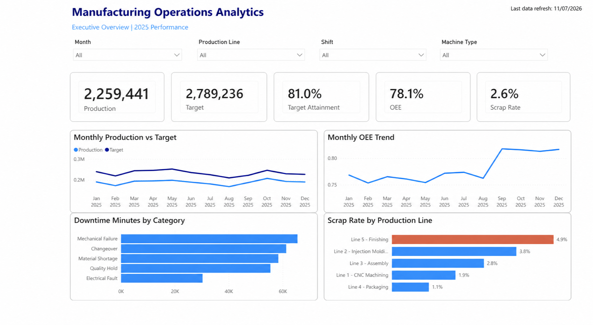
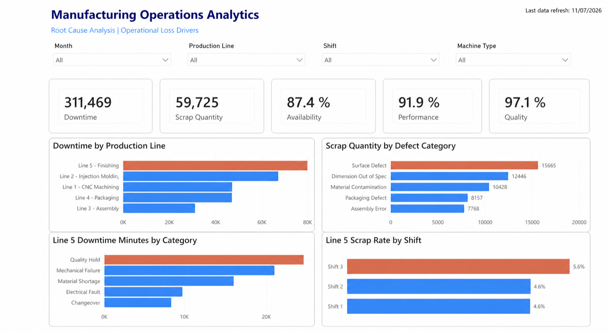

# Manufacturing Operations Analytics

End-to-end manufacturing analytics project using **SQL, Python, SQLite, Power BI, and continuous improvement principles** to evaluate production performance and identify operational bottlenecks.

The project analyzes **5,475 production records** across five manufacturing lines and three shifts during 2025. It combines a dimensional data model, reproducible SQL analysis, automated data-quality controls, exception reporting, and operational dashboards.

## Dashboard

### Executive overview



### Root-cause analysis



## Business objective

The analysis was designed to help an operations team answer five questions:

1. Are production lines meeting their targets?
2. Which lines generate the most downtime and scrap?
3. Where are the main operational bottlenecks?
4. How does production change over time?
5. Which line-month combinations require management attention?

## Solution workflow

```text
Source CSV files
       ↓
Python data loading
       ↓
SQLite star schema
       ↓
SQL analysis and data-quality checks
       ↓
Exception report and Power BI dashboard
       ↓
Operational insights and improvement priorities
```

## Technology stack

- **SQL:** joins, aggregations, CTEs, window functions, KPI calculations, and exception logic
- **SQLite:** relational database and dimensional data model
- **Python:** database creation, data loading, validation, and CSV export automation
- **Power BI:** executive reporting and root-cause visualization
- **Manufacturing analytics:** OEE, target attainment, scrap, downtime, and bottleneck analysis

## Data model

The SQLite database uses a star schema:

```text
                 dim_date
                     │
                  date_key
                     │
                     ▼
dim_machine ─── fact_production
   line_id          line_id
```

| Table | Purpose |
|---|---|
| `fact_production` | Production, target, good units, scrap, downtime, shift, and OEE components |
| `dim_machine` | Production line, area, machine type, product, risk, and maintenance strategy |
| `dim_date` | Calendar attributes for daily, weekly, monthly, quarterly, and yearly analysis |

The fact-table grain is **one row per production date, production line, and shift**.

## Dataset overview

| Metric | Result |
|---|---:|
| Period | 1 Jan–31 Dec 2025 |
| Production records | 5,475 |
| Production lines | 5 |
| Total production | 2,259,441 units |
| Total target | 2,789,236 units |
| Target attainment | 81.01% |
| Total scrap | 59,725 units |
| Overall scrap rate | 2.64% |
| Total downtime | 311,469 minutes |

## SQL portfolio analysis

The final portfolio queries are stored in [`sql/analysis`](sql/analysis):

| Query | Business question | Main SQL concepts |
|---|---|---|
| `01_production_by_line.sql` | Which line generates the highest output? | `JOIN`, `SUM`, `GROUP BY` |
| `02_target_attainment.sql` | Which lines are closest to their targets? | KPI calculation, `ROUND`, `NULLIF` |
| `03_scrap_rate_by_line.sql` | Which line has the highest scrap rate? | Aggregation and ratio calculation |
| `04_downtime_by_line.sql` | Which line generates the most downtime? | Aggregation and ranking |
| `05_overall_performance.sql` | Which lines show the weakest overall performance? | Multiple KPIs in one query |
| `06_monthly_production_trend.sql` | How does production change by month? | Date dimension and time aggregation |
| `07_month_over_month.sql` | How does each month compare with the previous month? | CTEs and `LAG()` window function |
| `08_critical_exceptions.sql` | Which line-months require management attention? | CTEs, `CASE`, and exception filtering |

## Key findings

### 1. Line 5 is the primary improvement opportunity

`Line 5 - Finishing` recorded the weakest combined operational performance:

- **72.89% target attainment**, the lowest of all five lines
- **4.89% scrap rate**, the highest of all five lines
- **87,191 downtime minutes**, the highest of all five lines
- **69.48% weighted OEE**, the lowest of all five lines

The combination of low attainment, high scrap, and high downtime makes this line the clearest priority for root-cause analysis and continuous improvement.

### 2. Line 4 combines high output with strong quality

`Line 4 - Packaging` generated the highest production volume at **646,253 units** and the lowest scrap rate at **1.11%**. Its target attainment was **83.62%**, showing that high absolute output does not necessarily mean the production target was fully achieved.

### 3. Monthly production showed clear volatility

The month-over-month analysis uses a `LAG()` window function to identify changes over time. The largest decline occurred in **February (-9.44%)**, followed by the strongest recovery in **March (+12.09%)**.

### 4. Exception logic converts analysis into action

The final SQL query classifies monthly line performance as `CRITICAL`, `WATCH`, or `NORMAL` based on target attainment and scrap rate. This reduces the need to review every record and focuses management attention on underperforming line-month combinations.

## Automated exception report

The Python automation investigates `Line 5 - Finishing`, `Shift 3`, during August 2025. A daily record is flagged when:

```text
Scrap rate >= 8%
OR
Downtime >= 100 minutes
```

Running the automation produces [`output/critical_exceptions.csv`](output/critical_exceptions.csv), containing **26 critical records** for further investigation.

## Data-quality controls

The automated quality report checks for:

- duplicate production IDs;
- production rows without a valid date;
- production rows without a valid machine;
- inconsistencies between good units, scrap, and total production;
- invalid availability, performance, quality, or OEE ranges.

All five controls currently pass with **zero issues requiring review**.

## Project structure

```text
manufacturing-operations-analytics/
├── assets/
│   ├── executive-overview.png
│   └── root-cause-analysis.png
├── data/
│   └── manufacturing.db
├── output/
│   └── critical_exceptions.csv
├── sql/
│   ├── 00_schema.sql
│   └── analysis/
│       ├── 01_production_by_line.sql
│       ├── 02_target_attainment.sql
│       ├── 03_scrap_rate_by_line.sql
│       ├── 04_downtime_by_line.sql
│       ├── 05_overall_performance.sql
│       ├── 06_monthly_production_trend.sql
│       ├── 07_month_over_month.sql
│       └── 08_critical_exceptions.sql
├── src/
│   ├── build_database.py
│   ├── export_critical_exceptions.py
│   └── quality_report.py
└── README.md
```

## How to run the project

The scripts use only the Python standard library, so no external Python packages are required.

### 1. Build the database

The loader expects `calendar_data.csv`, `machine_data.csv`, and `production_data.csv` in the parent portfolio directory.

```bash
python3 src/build_database.py
```

### 2. Run the data-quality report

```bash
python3 src/quality_report.py
```

### 3. Execute a portfolio query

```bash
sqlite3 -header -column data/manufacturing.db \
  < sql/analysis/05_overall_performance.sql
```

### 4. Export critical exceptions

```bash
python3 src/export_critical_exceptions.py
```

## Skills demonstrated

`SQL` · `Power BI` · `Python` · `SQLite` · `Data Analytics` · `Data Modeling` · `Manufacturing Analytics` · `Continuous Improvement` · `Root Cause Analysis` · `OEE` · `KPI Reporting`

## Portfolio summary

> Built an end-to-end manufacturing analytics solution using Python, SQLite, SQL, and Power BI. Analyzed 5,475 production records to evaluate OEE, production attainment, scrap, downtime, and operational bottlenecks across five production lines. Developed automated data-quality controls and exception reporting to identify the highest-priority improvement opportunities.
